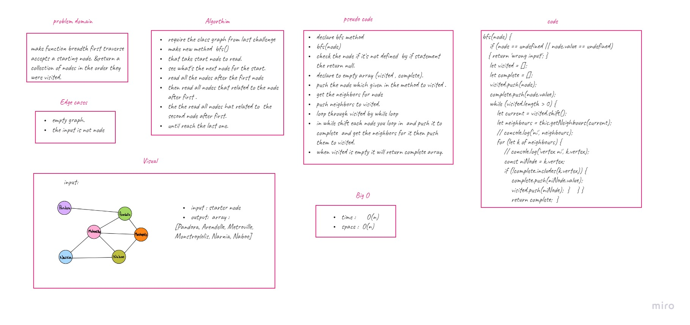

# data-structures-and-algorithms

Challenge	|   link    | image
------------|-----------|----------
class-01    | [class1](challenges/arrayReverse/array-reverse.js) | 
class-02    | [class2](challenges/arrayShift/array-shift.js) | 
class-03    | [class3](challenges/binary/array-binary-search.js) | 
class-04    | [class4](challenges/code4/code4.js) | 
class-05    | [class5](challenges/Data-Structures/linkedList/linked-list.js) | 
class-06    | [class6](challenges/Data-Structures/linklist2/linklist2.js) | 
class-07    | [class7](challenges/Data-Structures/link3/link3.js) | 
class-08    | [class8](challenges/Data-Structures/ll-zip/zip.js) | 
class-09    | [class9](challenges/Data-Structures/mock2) | 
class-10    | [class10](challenges/Data-Structures/stacksAndQueues) | 
class-11    | [class11](challenges/Data-Structures/PseudoQueue) | 
class-12    | [class12](challenges/Data-Structures/fifo-animal-shelter) | 
class-13    | [class13](challenges/Data-Structures/multi-bracket-validation) | 
class-14    | [class14](challenges/Data-Structures/mock2) | 
class-15    | [class15](challenges/Data-Structures/fifo-animal-shelter) | 
class-16    | [class16](challenges/Data-Structures/maxtree) | 
class-17    | [class17](challenges/Data-Structures/breadth) | 
class-18    | [class18](challenges/Data-Structures/fizzbuzz-tree) | 
class-26    | [class26](challenges/Data-Structures/insertionSort/selectionSort.js) | 
class-27    | [class27](challenges/Data-Structures/mergesort/merge.js) | 
class-28    | [class28](challenges/Data-Structures/QuickSort) | 
class-30    | [class30](challenges/Data-Structures/hashTable/hash.js) | 
class-31    | [class31](challenges/Data-Structures/repetedWord/repeat.js) | 
class-32    | [class32](challenges/Data-Structures/treeIntersection/treeIntersection.js) | 
class-33    | [class33](challenges/Data-Structures/LeftJoin/leftjoin.js) | 
class-35    | [class35](challenges/Data-Structures/graphs/graph.js) | 
class-36    | [class36](challenges/Data-Structures/graphbft/bft.js) | 
class-37    | [class37]() | 
class-38    | [class38]() | 

