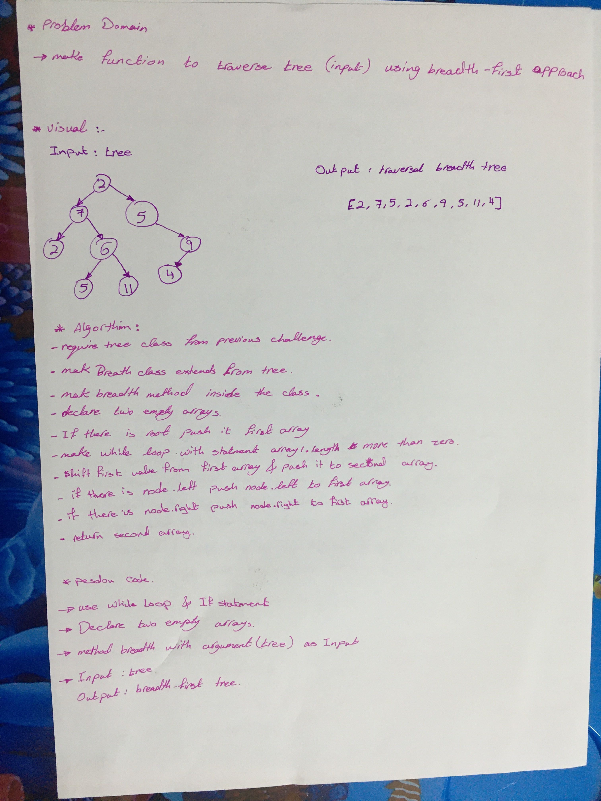

## Tree
A tree data structure can be defined recursively as a collection of nodes (starting at a root node), where each node is a data structure consisting of a value, together with a list of references to nodes (the "children"), with the constraints that no reference is duplicated, and none points to the root.

## Challenge
-  Write a breadth first traversal method which takes a Binary Tree as its unique input. Without utilizing any of the built-in methods available to your language, traverse the input tree using a Breadth-first approach, and return a list of the values in the tree in the order they were encountered.

## Approach & Efficiency
* creat class max extends from class tree.
* use classes and node implentation for tree and BST.
* big O :
   - O(n) : because we searching about place of node and worst case to be last node.
  

## whiteBoard:

  

