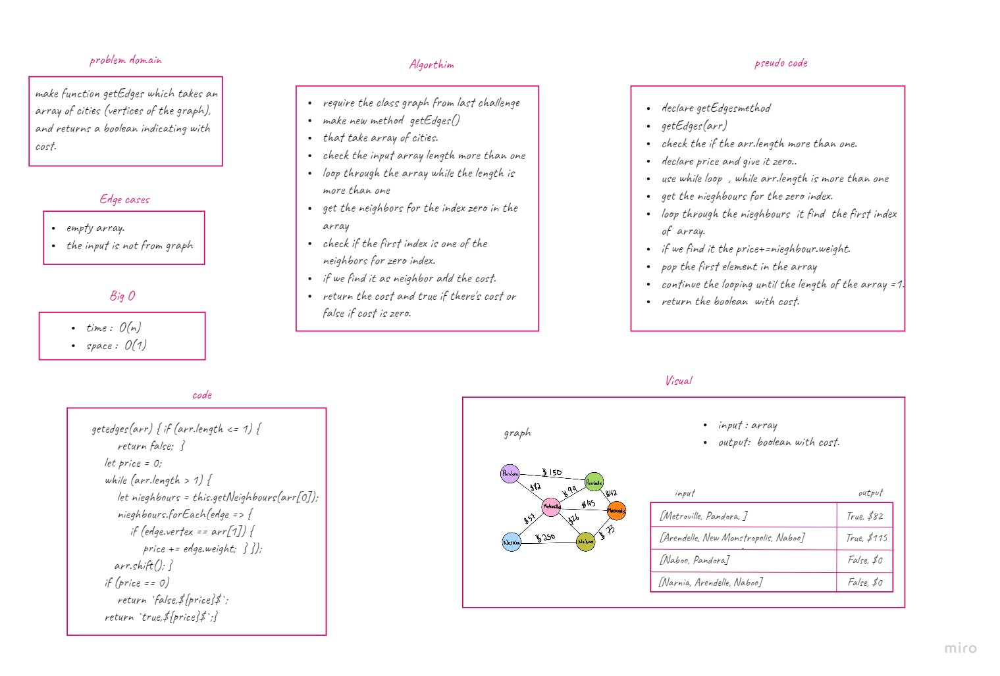

# Graph
consists of a finite (and possibly mutable) set of vertices (also called nodes or points), together with a set of unordered pairs of these vertices for an undirected graph or a set of ordered pairs for a directed graph.

## Challenge
* Write a function that takes in a graph and an array of cities (vertices of the graph), and returns a boolean indicating whether the full trip is possible between the cities with direct flights, and how much it would cost.

## Approach & Efficiency
* loops (while, forEach) and conditional statements.

## board:

