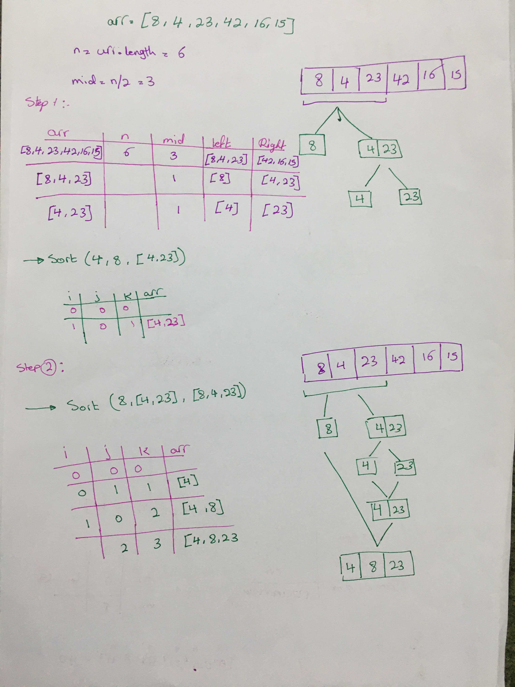
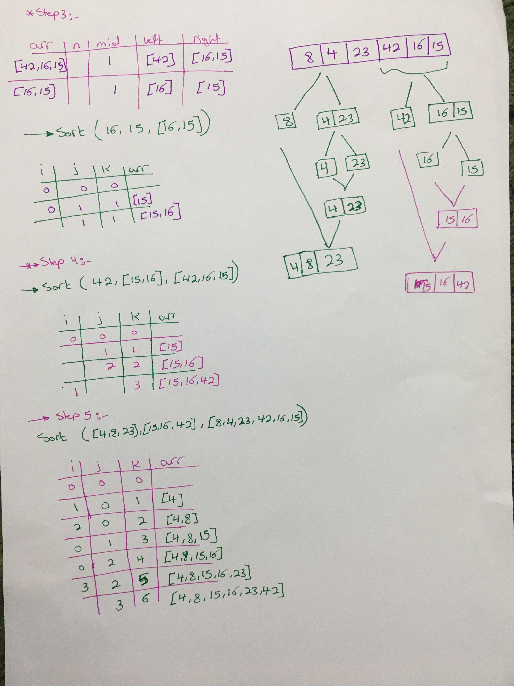

# Merge Sort
 It divides input array in two halves, calls itself for the two halves and then merges the two sorted halves. The merge() function is used for merging two halves

## Challenge (problrm Domain)
   
Create a function to sort the array by mergeSort method.

## Approach & Efficiency
* 
* Provide a visual step through for each of the sample arrays based on the provided pseudo code
* Convert the pseudo-code into working code Javascript
* Present a complete set of working tests

## Big O :
- nested loop 
    - space --> O(n).
    - time --> O(nlogn).

## Pseudocode

`
ALGORITHM Mergesort(arr)
    DECLARE n <-- arr.length
           
    if n > 1
      DECLARE mid <-- n/2
      DECLARE left <-- arr[0...mid]
      DECLARE right <-- arr[mid...n]
      // sort the left side
      Mergesort(left)
      // sort the right side
      Mergesort(right)
      // merge the sorted left and right sides together
      Merge(left, right, arr)

ALGORITHM Merge(left, right, arr)
    DECLARE i <-- 0
    DECLARE j <-- 0
    DECLARE k <-- 0

    while i < left.length && j < right.length
        if left[i] <= right[j]
            arr[k] <-- left[i]
            i <-- i + 1
        else
            arr[k] <-- right[j]
            j <-- j + 1
            
        k <-- k + 1

    if i = left.length
       set remaining entries in arr to remaining values in right
    else
       set remaining entries in arr to remaining values in left`

## Algorthim:

* check if the insert array is large than 0
* slice the insert array in mid to left and right 
* re-slice the left mid to left and right...untile the left contain one item and right contain one
* go to the sort function compare the left and right elemnt put the smaller one first.
* go up one step to comper left and right .

## board:

